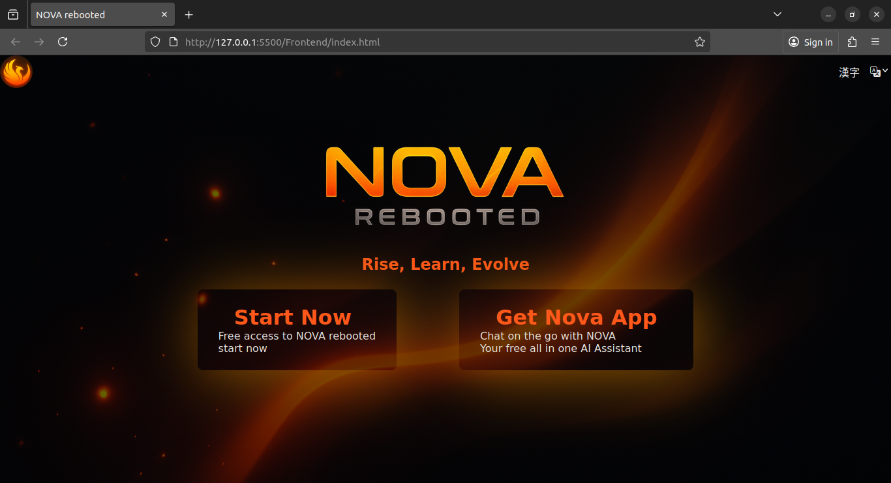
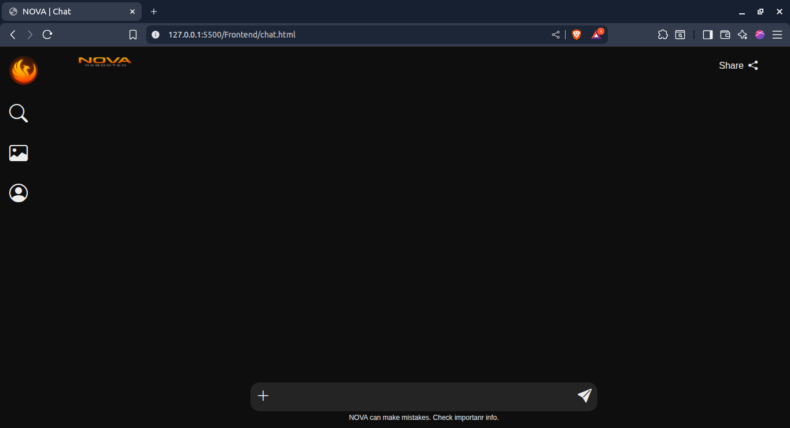

# 🌌 NOVA Rebooted

**Rise, Learn, Evolve.**

Nova Rebooted is the next evolution of **NOVA AI** — a blazing new concept for an all-in-one intelligent assistant.
Built with simplicity, speed, and creativity in mind, this prototype focuses on **UI design and front-end experience** for the future AI interface.

---

## 🔥 Preview



---

## ✨ Overview

**NOVA Rebooted** is a web-based AI assistant prototype designed to explore a modern, cinematic interface.
It blends **clean code structure** with a **futuristic visual identity**, inspired by energy, rebirth, and learning.

The current build focuses on:

* 🔥 Hero section & first impression design
* ⚙️ Basic layout and typography system
* 🎨 Flame-inspired color palette
* 🌍 Language selector prototype

---

## 🧩 Tech Stack

| Technology                       | Purpose                         |
| -------------------------------- | ------------------------------- |
| **HTML5**                        | Core structure                  |
| **CSS3 (Vanilla)**               | Styling and layout              |
| **Bootstrap Icons**              | Icons for UI                    |
| **Custom Variables (CSS :root)** | Theme control and color palette |

---

## 🎨 Color Palette

| Variable            | Color     | Description                       |
| ------------------- | --------- | --------------------------------- |
| `--background`      | `#0E0E0E` | Deep black background             |
| `--primary-flame`   | `#FF6B00` | Main accent (fire orange)         |
| `--secondary-flame` | `#FFB347` | Secondary glow                    |
| `--accent`          | `#FF4500` | Strong highlight (inferno orange) |
| `--text`            | `#EDEDED` | Light gray text                   |

---

## 🧱 Current Features

* 🔹 **Hero Section:** Full-screen landing view with title, tagline, and CTA cards.
* 🔹 **Navigation Bar:** Simple language selector with icon.
* 🔹 **Typography:** Clean sans-serif (“Poppins”) for modern readability.
* 🔹 **CTA Cards:** Interactive buttons for app or web experience entry.
* 🔹 **Dark Theme:** Flame-inspired gradients and glowing shadows.

---

## 🧠 Vision

NOVA Rebooted aims to evolve into a **smart AI ecosystem**:

* 💬 Chat and interact naturally with the AI assistant
* 📱 Seamless cross-device integration (web + mobile)
* 🧹 Modular interface adaptable to future AI tools
* ⚡ Fast, elegant, and personal

This prototype is the **foundation** — focusing first on design, feel, and structure before backend logic is implemented.

---

## 🛠️ Installation & Setup

Clone the repository and open the prototype locally:

```bash
git clone https://github.com/<your-username>/Nova-Rebooted.git
cd Nova-Rebooted
```

Then open the HTML file in your browser:

```bash
Frontend/index.html
```

💡 **Tip:** Use a local server (like VS Code Live Server) for smoother loading of image assets and relative paths.

---

## 🗟️ Folder Structure

```
Nova-Rebooted/
│
├── Frontend/
│   ├── images/
│   │   ├── nova-logo4.png
│   │   ├── nova-font2.png
│   │   └── background1.png
│   ├── index.html
│   ├── styles.css
│   ├── login.html
│   ├── login.css
│   └── displayToggle.js
│
└── README.md
```

---

## 🌠 Preview

The hero section features the blazing **“NOVA REBOOTED”** logo, tagline **“Rise, Learn, Evolve”**, and two glowing CTA cards for instant action.

---

## 🔮 Roadmap

* Add interactive navbar & hover animations
* Implement mobile responsiveness
* Introduce subtle background motion (animated embers or flame trails)
* Connect front-end to AI backend
* Launch Nova App (cross-platform)

---

## 🔗 New Feature: Login & Sign-up System

---

## 🔥 Preview


---

### 📢 Description

This update introduces a **dual-container authentication interface**, designed within a **single HTML page**.
Instead of redirecting to a separate page, users can **toggle between Login and Sign-up views** seamlessly using JavaScript.
This creates a faster and smoother user experience — no page reloads required.

### 💡 What We Learned

* Multiple containers (**login** and **sign-up**) can exist in the same HTML file.
* By using **JavaScript class toggling**, we can switch between these containers without reloading the page.
* Each container shares the same CSS variables and styles for a unified design.
* The `hidden` class with `display: none` controls visibility effectively.
* **Bootstrap Icons** integrate well for simple UI enhancements.
* Targeting placeholder text with `input::placeholder` can help align visual consistency.

### 🔧 How It Works

* **HTML:** Two main containers (`login-container` and `sign-up-container`) inside the same page.
* **CSS:** Shared styles and variables for layout consistency.
* **JavaScript:** Simple event listeners (`onclick`) that add/remove the `.hidden` class to toggle visibility.

### 💻 Key Takeaways

* Clean and minimalistic UI built on custom CSS variables.
* No external libraries for logic — just pure JavaScript.
* Great example of how to manage dynamic UI transitions without routing.

### 💡 Next Steps

* Add **form validation** before submission.
* Add **error/success messages** for user feedback.
* Explore **animation transitions** between forms for a smoother UX.

---


## 🌐 New Feature: Chat Page Interface

---

## 🔥 Preview



---

### 📢 Description

This update introduces the **NOVA Chat Page Interface** — a clean, minimalistic layout for future AI interactions.  
The focus is on **visual hierarchy**, **dark theme consistency**, and **practical layout composition** using Flexbox.

The design features a **sidebar with Bootstrap icons**, a **top navigation bar** with a share button, and a **central chat area** with an input field and controls.  
Every section is intentionally simple, optimized for clarity and smooth user experience.

### 💡 What We Learned

* Practiced **Flexbox alignment** to structure the page horizontally with sidebar and main content.
* Reinforced use of **CSS variables** for consistent theme and color palette management.
* Implemented **hover effects** for subtle interactivity using only pure CSS.
* Enhanced design visibility with a **secondary background color (`--secondary-background`)** for better contrast in UI elements.
* Integrated **Bootstrap Icons** seamlessly for clean iconography and scalability.

### 🔧 How It Works

* **HTML:**  
  The structure consists of two main parts — a sidebar (`aside`) for icons and a `main` container for navigation, chat area, and input field.  
  Icons and images are managed using simple `<i>` elements from Bootstrap Icons and `` tags for branding.

* **CSS:**  
  The layout uses Flexbox for alignment (`flex-direction: row` for the chat page, `column` for icons).  
  Global styling is handled through `:root` variables for colors, ensuring consistent theme application.  
  Hover effects and icon placement are managed through relative and absolute positioning for intuitive spacing.

* **Design Touches:**  
  The **secondary background** helps inputs and hover states stand out from the main background.  
  Rounded corners and spacing create a soft, professional feel consistent with the overall NOVA identity.

### 💻 Key Takeaways

* Practicing **fundamentals repeatedly** strengthens design intuition.  
* Small changes like background contrast or hover transitions can make interfaces feel polished.  
* Flexbox remains one of the most powerful tools for responsive layout control.  
* Using minimal assets (only HTML + CSS + Bootstrap Icons) can still produce a clean, futuristic design.

### 💡 Next Steps

* Implement **message rendering** for user and AI responses.  
* Add **typing animations** or message bubbles for realism.  
* Integrate **basic JavaScript logic** for sending and displaying chat messages.  
* Explore **responsive scaling** for tablet and mobile viewports.

---

## 👨‍💻 Author

**Yusef Codes**
